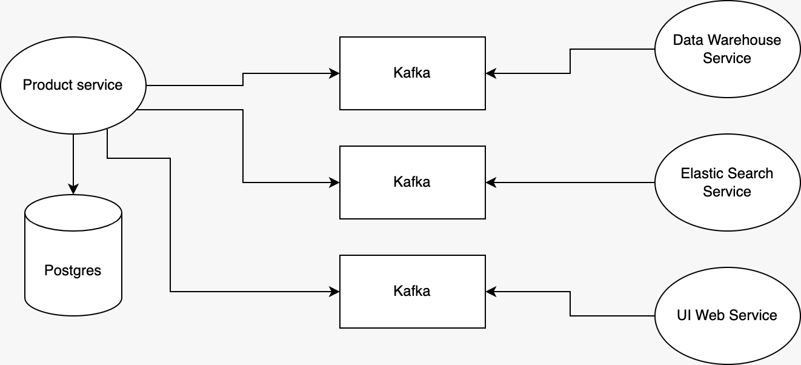

# Awesome store

A store that sells a variety of amazing products. What it does:

+ Manage products via REST API
+ Notify other consumer services of newly created products via Kafka


(The diagram shows a desired system design where Kafka consumers are different services. Extra services such as Zookeeper are opted out for clarity.)

## Quickstart

The project includes three modules:

+ `bom`: a [Bill of Materials](https://www.baeldung.com/spring-maven-bom) that manages shared dependencies
+ `product`: a Spring Boot app that provides CRUD for products
+ `consumer`: a Spring Boot app that is a consumer of the `product` app

#### 1) Build the apps

At the module directories of `bom`, `product`, and `consumer`, run this command
```shell
mvn clean install
```

#### 2) Spin up the stack

At the project directory, run this command

```sh
docker compose up -d
```

#### 3) Verify service "product"

Create a product
```shell
curl --location 'http://localhost:50001/products' \
--header 'Content-Type: application/json' \
--data '{
    "name": "pasta",
    "price": 42
}'
```

Response
```json
{
  "id": "a2dc29c5e0d54b5f8651e4c602a77b77",
  "name": "pasta",
  "price": 42.0,
  "createdBy": "0ab54fa913ed423cb267f5feb301b268",
  "createdAt": "2023-04-28T09:06:21.92219219",
  "updatedBy": "d5e500593dc644ba8a181f6c140226b5",
  "updatedAt": "2023-04-28T09:06:21.92219219"
}
```

#### 4) Verify Kafka messages

Show logs of `consumer` to see if the message has been received.
```shell
docker logs -f awesome-store-consumer-1
```

The log should contain
```shell
Received message in group 'consumer': {"productId": "a2dc29c5e0d54b5f8651e4c602a77b77", "price": 42.0}
```

## API-first approach

Awesome store chooses [API First approach](https://swagger.io/resources/articles/adopting-an-api-first-approach/) using [Open API 3.0](https://swagger.io/specification/) and [Open API Maven Generator](https://github.com/OpenAPITools/openapi-generator/tree/master/modules/openapi-generator-maven-plugin) to boost API development and allow foreseeing how the product looks like. The generated code can be overridden via [Mustache templates](https://mustache.github.io/mustache.5.html) such as [data transfer object](https://github.com/emeraldhieu/awesome-store/blob/master/product/src/main/resources/templates/pojo.mustache). The REST API can be viewed via [Swagger UI](http://localhost:50001/swagger-ui/index.html).

## Message queue

Whenever a product is created, a message is sent to Kafka for other services to consume. This way other services will be notified of the newly created product.

### Why Kafka?

Kafka is used to send notifications to other microservices asynchronously in real time. It has these advantages:

+ Scalability: 
  + A Kafka cluster can span across multiple data centers
  + A single topic can place partitions on different brokers 
+ Multiple producers and consumers
  + Messages can be collected from different sources
  + Consumer group allows pulling messages from different partitions in parallel
+ Fault tolerance and high availability:
  + Data is copied and spread on different brokers
  + If one broker fails, data won't be lost
+ High performance
  + [A single Kafka broker can handle hundreds of megabytes of reads and writes per second from thousands of clients](https://projects.apache.org/project.html?kafka) 

## Schema registry

As Product's Kafka messages tend to evolve by development's needs, [Confluent Avro](https://docs.confluent.io/2.0.0/schema-registry/docs/intro.html) is used to version schemas of Kafka messages. Schemas are stored in Kafka's log files and indices are stored in Avro's in-memory storage. For example, ProductMessage's schema:
```
{
    "type": "record",
    "name": "ProductMessage",
    "namespace": "com.emeraldhieu.awesomestore.product",
    "fields":
    [
        {
            "name": "productId",
            "type": "string"
        },
        {
            "name": "price",
            "type": "double"
        }
    ]
}
```

## Database schema change management

[Liquibase](https://docs.liquibase.com/tools-integrations/springboot/springboot.html) supports revisioning, deploying and rolling back database changes. On top of that, it allows [initializing data from CSV](https://docs.liquibase.com/change-types/load-data.html) for demonstrative purpose.

## Java beans mappings

Like Lombok, [Mapstruct](https://github.com/mapstruct/mapstruct) is a code generator library that supports mapping between entities and DTOs without writing boilerplate code. A significant benefit is that mappers don't need unit tests because there's no code to test!

## Product API

### 1) List products

```
GET /products
```

#### Request parameters (optional)

| Parameters   | Description   | Format                                   |
|--------------|---------------|------------------------------------------|
| `sortOrders` | Sort products | column1,direction&#124;column2,direction |

Some examples of `sortOrders`:
+ `createdAt,desc`
+ `updatedAt,desc|createdBy,asc`

#### Example

##### List products

```sh
curl --location 'http://localhost:50001/products?sortOrders=updatedAt%2Cdesc%7CcreatedBy%2Casc'
```

##### Response

```json
[
  {
    "id": "0a5eb04756f54776ac7752d3c8fae45b",
    "name": "spaghetti",
    "price": 3.14,
    "createdBy": "20825389f950461b8766c051b9182dd4",
    "createdAt": "2022-11-27T00:00:00",
    "updatedBy": "cca4806536fe4b218c12cdcde4d173df",
    "updatedAt": "2022-11-28T00:00:00"
  }
]
```

### 2) Create a product

```
POST /products
```

#### Request body

Required parameters

| Parameters | Type   | Description |
|------------|--------|-------------|
| `name`     | String | Name        |
| `price`    | Double | Price       |

#### Example

##### Create a product

```sh
curl --location 'http://localhost:50001/products' \
--header 'Content-Type: application/json' \
--data '{
    "name": "coke",
    "price": 123
}'
```

##### Response

```json
{
  "id": "a65944903bd94b1dabee196323542ed9",
  "name": "coke",
  "price": 123.0,
  "createdBy": "4b93f05a150d489d949abb71ec0d3c58",
  "createdAt": "2023-04-27T00:35:59.378757",
  "updatedBy": "87d708c4766f461d8fa718ce50249081",
  "updatedAt": "2023-04-27T00:35:59.378757"
}
```

### 3) Get a product

```
GET /products/<id>
```

#### Path parameters

| Parameters | Description | Type   |
|------------|-------------|--------|
| `id`       | Product ID  | String |

#### Example

##### Get a product

```sh
curl --location 'http://localhost:50001/products/a65944903bd94b1dabee196323542ed9'
```

##### Response

```json
{
  "id": "a65944903bd94b1dabee196323542ed9",
  "name": "coke",
  "price": 123.0,
  "createdBy": "4b93f05a150d489d949abb71ec0d3c58",
  "createdAt": "2023-04-27T00:35:59.378757",
  "updatedBy": "87d708c4766f461d8fa718ce50249081",
  "updatedAt": "2023-04-27T00:35:59.378757"
}
```

### 4) Delete a product

```
DELETE /products/<id>
```

#### Path parameters

| Parameters | Description | Type   |
|------------|-------------|--------|
| `id`       | Product ID  | String |

#### Example

##### Delete a product

```sh
curl --location --request DELETE 'http://localhost:50001/products/a65944903bd94b1dabee196323542ed9'
```

Response status is 204 with no content

## Resources

+ [Postman collections](https://github.com/emeraldhieu/awesome-store/blob/master/postman) for testing API